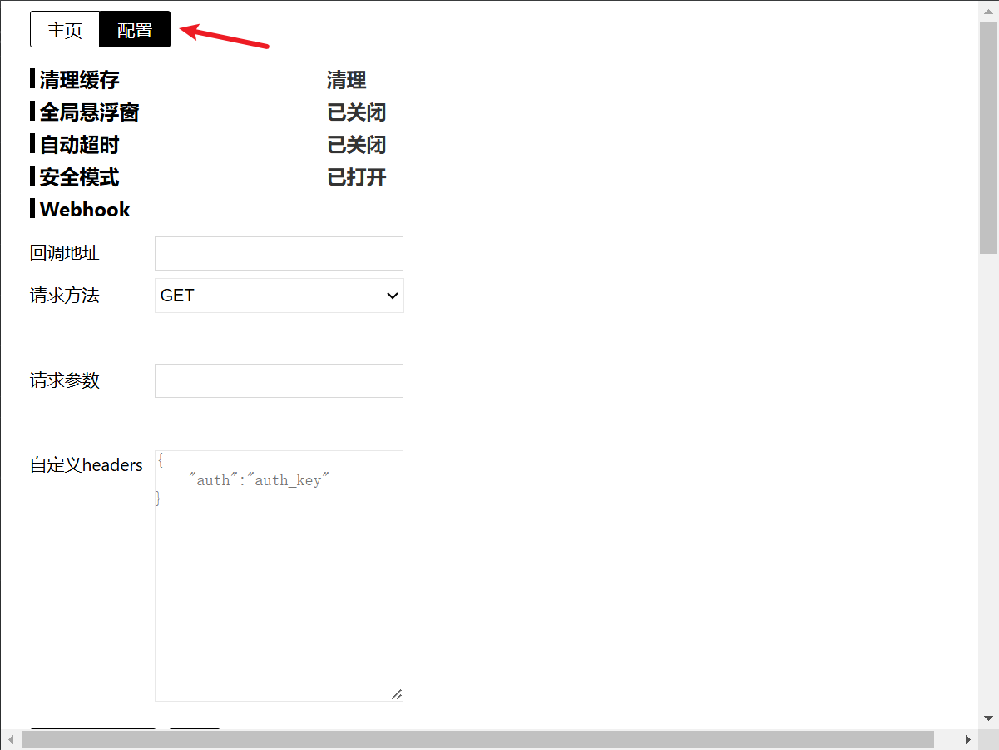
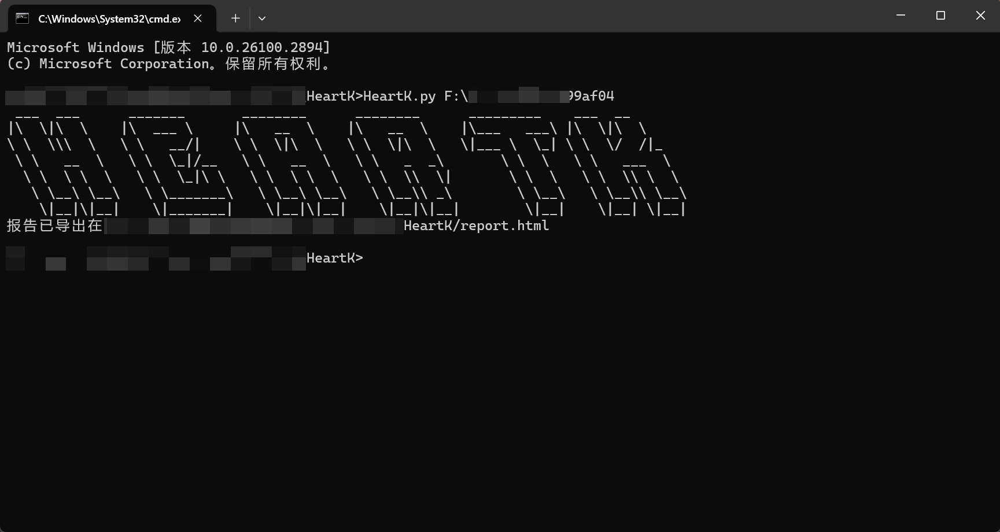
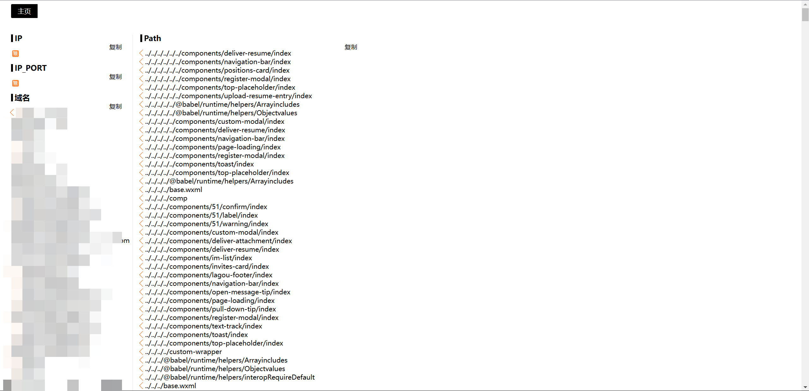

# HeartK

## 项目介绍

本项目基于残笑大佬的<a href="https://github.com/momosecurity/FindSomething">FindSomething</a>插件进行的本地移植版，可对指定的目录下的所有html、js文件或单个html、js文件进行扫描并获取敏感信息.

## 必看说明

1. 本项目基于node.js环境，如无node.js环境请自行安装，官网：`https://nodejs.org/zh-cn/download/`
2. 工具扫描完毕后会将敏感信息导出在指定的目录或工具根目录下的`report.html`

## 快速上手

使用时必须指定要扫描的目录或单个html、js文件：
```shell
HeartK.py path
```

输出详细信息指定-d，可选项：
```shell
HeartK.py -d
```

指定要导出报告的路径，不指定默认导出在运行工具的目录下，可选项：
```shell
HeartK.py -e path
```
或
```shell
HeartK.py --export path
```

## 注意事项

1. **如要指定导出报告的路径，只写目录即可，不要指定文件名。**
2. 本项目导出的报告中移除了残笑大佬的配置项：


## 效果图




## 鸣谢

本项目离不开残笑大佬的帮助与支持，在此鸣谢。

## Contact

如有bug或其他问题可提交issues，或者关注公众号Spade sec联系我。